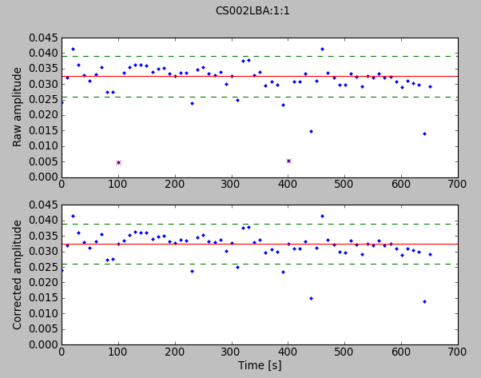

===========
edit-parmdb
===========

This software was created in support of `LOFAR's <http://www.lofar.org/>`_
`Multifrequency Snapshot Sky Survey
<http://www.astron.nl/about-astron/press-public/news/international-lofar-radio-telescope-kicks-all-sky-survey/internationa>`_
(MSSS) during the week of 13 to 17 February 2012.

These tools are designed to provide an easy-to-use interface for manipulating
the BBS `parameter database
<http://www.lofar.org/operations/doku.php?id=engineering:software:tools:parmdbm>`_.
It provides a wrapper which extends the existing ``lofar.parmdb``
interface, making it possible to write values into the parameter database from
Python code. This is then used to provide a (reasonably!) user-friendly way to
filter bad gain solutions from ``instrument`` databases produced during MSSS
processing.

Filtering an instrument database
--------------------------------

And end user on the LOFAR CEP2 can run the code as
``~/swinbank/edit_parmdb/edit_parmdb.py``. A (brief) help message is provided
by the ``--help`` option::

  $ ~swinbank/edit_parmdb/edit_parmdb.py --help
  Usage: edit_parmdb.py [options]
  Options:
        --last         Include last value
        --interactive  Interactive mode
        --sigma=       Clip at sigma * median [default: 3]
        --station=     Process this station
        --version
        --help         Display this help and exit.

   An example of ``edit_parmdb.py`` in use.
